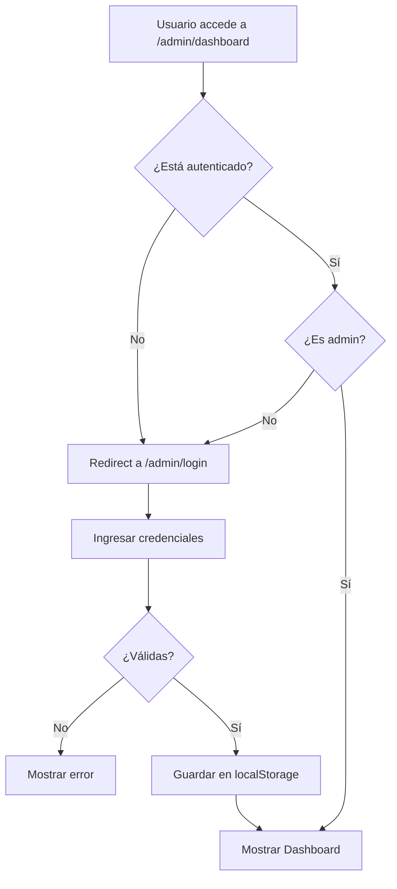

# 📱 SmartStore - E-commerce de Tecnología

<div align="center">


**Aplicación web moderna de comercio electrónico especializada en teléfonos celulares, accesorios y ofertas especiales.**

[🌐 Demo en Vivo](https://julianlargo72.github.io/Proyecto-frontend/) • [📋 Documentación](#-tabla-de-contenido) • [🚀 Instalación](#-instalación-y-configuración)

</div>

---

## 📑 Tabla de Contenido

- [Descripción General](#-descripción-general)
- [Características Principales](#-características-principales)
- [Arquitectura del Proyecto](#-arquitectura-del-proyecto)
- [Patrones de Diseño](#-patrones-de-diseño-implementados)
- [Estructura del Proyecto](#-estructura-del-proyecto)
- [Tecnologías y Dependencias](#-tecnologías-y-dependencias)
- [Instalación y Configuración](#-instalación-y-configuración)
- [Guía de Uso](#-guía-de-uso)
- [Sistema de Rutas](#-sistema-de-rutas)
- [Gestión de Estado](#-gestión-de-estado)
- [Validaciones y Formularios](#-validaciones-y-formularios)
- [Estilos y Diseño](#-estilos-y-diseño)
- [Despliegue en GitHub Pages](#-despliegue-en-github-pages)
- [Panel de Administración](#-panel-de-administración)

---

## 📖 Descripción General

**SmartStore** es una aplicación web de comercio electrónico desarrollada con **Angular 19** que implementa patrones de diseño modernos y buenas prácticas de desarrollo. La aplicación permite a los usuarios navegar por un catálogo de productos tecnológicos, gestionar un carrito de compras y realizar pedidos de manera intuitiva.

### 🎯 Objetivos del Proyecto

- Implementar una arquitectura escalable y mantenible usando Angular
- Aplicar patrones de diseño como **Observer**, **Singleton** y **Guard**
- Desarrollar una interfaz de usuario moderna y responsive
- Gestionar estado reactivo con RxJS
- Implementar un sistema de autenticación y autorización
- Crear un panel de administración CRUD completo

---

## ✨ Características Principales

### 🛒 Funcionalidades Públicas

- **Catálogo de Productos**: Exploración de teléfonos celulares con información detallada
- **Accesorios Tecnológicos**: Sección dedicada a accesorios compatibles
- **Ofertas Especiales**: Productos con descuentos y promociones limitadas
- **Carrito de Compras**: Gestión dinámica de productos seleccionados
- **Proceso de Checkout**: Formulario completo para finalizar compras
- **Sistema de Búsqueda**: Filtrado de productos por características
- **Detalles de Producto**: Vista ampliada con especificaciones técnicas
- **Soporte al Cliente**: Formulario de contacto con generación de tickets

### 🔐 Funcionalidades de Administración

- **Panel de Control**: Dashboard centralizado para gestión de contenido
- **CRUD de Productos**: Crear, leer, actualizar y eliminar teléfonos
- **CRUD de Accesorios**: Gestión completa de accesorios
- **CRUD de Ofertas**: Administración de productos en promoción
- **Autenticación**: Sistema de login con validación de credenciales
- **Persistencia de Sesión**: Mantener sesión activa con localStorage
- **Protección de Rutas**: Guard que valida permisos de administrador

### 📱 Características Técnicas

- **Responsive Design**: Adaptable a dispositivos móviles, tablets y escritorio
- **Progressive Enhancement**: Carga optimizada de recursos
- **Lazy Loading**: Carga diferida de módulos para mejor rendimiento
- **Single Page Application**: Navegación fluida sin recargas de página
- **Estado Reactivo**: Actualización automática de la UI con cambios de datos
- **Validación de Formularios**: Template-driven forms con validaciones HTML5

---

## 🏗️ Arquitectura del Proyecto

### Arquitectura de Componentes

El proyecto sigue una arquitectura modular basada en **Standalone Components** de Angular 19, eliminando la necesidad de NgModules tradicionales.

```
┌─────────────────────────────────────────┐
│           App Component                 │
│         (Componente Raíz)               │
└──────────────┬──────────────────────────┘
               │
    ┌──────────┴──────────┐
    │                     │
┌───▼────┐          ┌────▼────┐
│ Header │          │  Router │
│        │          │  Outlet │
└────────┘          └────┬────┘
                         │
        ┌────────────────┼────────────────┐
        │                │                │
   ┌────▼─────┐    ┌────▼─────┐    ┌────▼─────┐
   │   Home   │    │ Catálogo │    │  Admin   │
   └──────────┘    └────┬─────┘    └────┬─────┘
                        │                │
                   ┌────▼─────┐    ┌────▼─────┐
                   │ Detalle  │    │Dashboard │
                   └──────────┘    └──────────┘
```

### Capas de la Aplicación

#### 1. **Capa de Presentación** (Components)
- Componentes standalone reutilizables
- Templates HTML con interpolación y directivas
- Estilos CSS encapsulados por componente
- Event binding y property binding

#### 2. **Capa de Lógica de Negocio** (Services)
- Servicios inyectables con `providedIn: 'root'`
- Gestión de estado con RxJS BehaviorSubjects
- Operadores RxJS para transformación de datos
- Manejo de errores con catchError

#### 3. **Capa de Datos** (Models & Interfaces)
- Interfaces TypeScript para type safety
- Modelos de dominio (Celular, Accesorio, Oferta, Usuario)
- DTOs para transferencia de datos

#### 4. **Capa de Enrutamiento** (Router)
- Configuración de rutas con lazy loading
- Guards para protección de rutas
- Resolvers para pre-carga de datos
- Navegación programática

---

## 🎨 Patrones de Diseño Implementados

### 1. **Observer Pattern** (Patrón Observador)

**Ubicación**: Servicios de datos (`product.service.ts`, `accesorio.service.ts`, `oferta.service.ts`)

**Implementación**:
```typescript
export class ProductService {
  private productosCache$ = new BehaviorSubject<Celular[]>([]);
  
  // Observable público para suscripciones
  getProductosCache(): Observable<Celular[]> {
    return this.productosCache$.asObservable();
  }
  
  // Actualización que notifica a todos los observadores
  agregarProducto(producto: Omit<Celular, 'slug'>): Observable<Celular> {
    const productos = this.productosCache$.value;
    this.productosCache$.next([...productos, nuevoProducto]);
    return of(nuevoProducto);
  }
}
```

**Beneficios**:
- ✅ Desacoplamiento entre componentes y servicios
- ✅ Actualización automática de la UI ante cambios de datos
- ✅ Múltiples componentes pueden reaccionar al mismo cambio
- ✅ Gestión eficiente de subscripciones con `takeUntil`

**Uso en Componentes**:
```typescript
ngOnInit() {
  this.productService.getProductosCache()
    .pipe(takeUntil(this.destroy$))
    .subscribe(productos => {
      this.productos = productos; // UI se actualiza automáticamente
    });
}
```

### 2. **Singleton Pattern** (Patrón Singleton)

**Ubicación**: Todos los servicios con `providedIn: 'root'`

**Implementación**:
```typescript
@Injectable({ providedIn: 'root' })
export class CartService {
  private static instance: CartService;
  private items: CartItem[] = [];
  
  // Angular garantiza una única instancia en toda la app
}
```

**Beneficios**:
- ✅ Una sola instancia del carrito en toda la aplicación
- ✅ Estado compartido entre componentes
- ✅ Gestión eficiente de memoria
- ✅ Inyección de dependencias simplificada

### 3. **Guard Pattern** (Patrón Guardián)

**Ubicación**: `auth.guard.ts`

**Implementación**:
```typescript
export const authGuard: CanActivateFn = (route, state) => {
  const authService = inject(AuthService);
  const router = inject(Router);
  
  if (authService.isLogged && authService.isAdmin) {
    return true;
  }
  
  router.navigate(['/admin/login'], {
    queryParams: { returnUrl: state.url }
  });
  return false;
};
```

**Protección de Rutas**:
```typescript
{
  path: 'admin/dashboard',
  component: DashboardComponent,
  canActivate: [authGuard] // Solo admin autenticados
}
```

**Beneficios**:
- ✅ Protección de rutas sensibles
- ✅ Redirección automática a login
- ✅ Validación de permisos centralizada
- ✅ Mejora la seguridad de la aplicación

### 4. **Service Pattern** (Patrón de Servicio)

**Ubicación**: Carpeta `core/`

**Separación de Responsabilidades**:
- `ProductService`: Gestión de productos
- `CartService`: Lógica del carrito
- `AuthService`: Autenticación y autorización
- `AccesorioService`: Gestión de accesorios
- `OfertaService`: Gestión de ofertas

**Beneficios**:
- ✅ Código reutilizable
- ✅ Lógica de negocio separada de la UI
- ✅ Inyección de dependencias

### 5. **Repository Pattern** (Patrón Repositorio)

**Implementación**: Servicios que abstraen el acceso a datos

```typescript
export class ProductService {
  private http = inject(HttpClient);
  private readonly jsonUrl = 'data/productos.json';
  
  // Abstrae la fuente de datos
  getCelulares(): Observable<Celular[]> {
    return this.http.get<Celular[]>(this.jsonUrl)
      .pipe(
        catchError(error => {
          console.error('Error:', error);
          return of([]);
        })
      );
  }
}
```

**Beneficios**:
- ✅ Abstracción de la fuente de datos
- ✅ Fácil cambio de backend (JSON → API REST)
- ✅ Manejo centralizado de errores
- ✅ Cacheo de datos

---

## 📁 Estructura del Proyecto

```
proyecto-frontend/
│
├── src/
│   ├── app/
│   │   ├── compartidos/          # Componentes compartidos
│   │   │   └── componentes/
│   │   │       ├── header/       # Navegación principal
│   │   │       └── footer/       # Pie de página
│   │   │
│   │   ├── core/                 # Servicios centrales
│   │   │   ├── product.service.ts
│   │   │   ├── accesorio.service.ts
│   │   │   ├── oferta.service.ts
│   │   │   ├── auth.service.ts
│   │   │   ├── cart.service.ts
│   │   │   ├── auth.guard.ts
│   │   │   ├── constants/        # Constantes de la app
│   │   │   └── utils/            # Utilidades (slug generator)
│   │   │
│   │   ├── paginas/              # Páginas de la aplicación
│   │   │   ├── home/             # Página de inicio
│   │   │   ├── products/         # Catálogo y detalle
│   │   │   │   ├── catalogo-component/
│   │   │   │   └── detalle-prod-component/
│   │   │   ├── accesorios/       # Accesorios
│   │   │   │   ├── catalogo-accesorios/
│   │   │   │   └── detalle-accesorio/
│   │   │   ├── ofertas/          # Ofertas especiales
│   │   │   │   ├── catalogo-ofertas/
│   │   │   │   └── detalle-oferta/
│   │   │   ├── cart/             # Carrito y checkout
│   │   │   │   ├── carrito-component/
│   │   │   │   └── checkout/
│   │   │   ├── admin/            # Panel de administración
│   │   │   │   └── dashboard/
│   │   │   ├── auth/             # Autenticación
│   │   │   │   └── login-admin/
│   │   │   └── soporte/          # Soporte al cliente
│   │   │
│   │   ├── app.component.ts      # Componente raíz
│   │   ├── app.config.ts         # Configuración de la app
│   │   └── app.routes.ts         # Configuración de rutas
│   │
│   ├── index.html                # HTML principal
│   ├── main.ts                   # Punto de entrada
│   ├── styles.css                # Estilos globales
│   └── styles.scss               # Variables SCSS
│
├── public/                       # Recursos estáticos
│   ├── data/                     # Datos en formato JSON
│   │   ├── productos.json
│   │   ├── accesorios.json
│   │   ├── ofertas.json
│   │   └── usuarios.json
│   ├── img/                      # Imágenes generales
│   ├── banner.png
│   ├── logoTienda.png
│   └── favicon.ico
│
├── docs/                         # Build para GitHub Pages
├── angular.json                  # Configuración de Angular CLI
├── package.json                  # Dependencias del proyecto
├── tsconfig.json                 # Configuración de TypeScript
├── README.md                     # Este archivo
└── CREDENCIALES_ADMIN.md         # Credenciales de administrador
```

---

## 🛠️ Tecnologías y Dependencias

### Frontend Framework

| Tecnología | Versión | Propósito |
|-----------|---------|-----------|
| **Angular** | 19.0.0 | Framework principal |
| **TypeScript** | 5.6.2 | Lenguaje de programación |
| **RxJS** | 7.8.0 | Programación reactiva |
| **Angular Material** | 19.2.19 | Componentes UI |
| **Angular CDK** | 19.2.19 | Component Dev Kit |

### Librerías Core

- **@angular/router**: Sistema de navegación SPA
- **@angular/forms**: Gestión de formularios
- **@angular/common**: Pipes y directivas comunes
- **@angular/animations**: Animaciones fluidas

### Herramientas de Desarrollo

- **Angular CLI**: Generación de código y build
- **Karma**: Test runner
- **Jasmine**: Framework de testing
- **TypeScript Compiler**: Compilación de TS a JS

### Estilos

- **CSS3**: Estilos personalizados
- **SCSS**: Preprocesador CSS
- **Material Theme**: Azure Blue
- **Flexbox & Grid**: Layouts responsive

---

## 🚀 Instalación y Configuración

### Prerrequisitos

Asegúrate de tener instalado:

- **Node.js**: v18 o superior
- **npm**: v9 o superior
- **Angular CLI**: v19.0.0

```bash
node --version  # Verifica versión de Node.js
npm --version   # Verifica versión de npm
```

### Instalación de Angular CLI

```bash
npm install -g @angular/cli@19.0.0
```

### Paso 1: Clonar el Repositorio

```bash
git clone https://github.com/JulianLargo72/Proyecto-frontend.git
cd Proyecto-frontend
```

### Paso 2: Instalar Dependencias

```bash
npm install
```

Este comando instalará todas las dependencias listadas en `package.json`.

### Paso 3: Iniciar Servidor de Desarrollo

```bash
npm start
# O alternativamente:
ng serve
```

La aplicación estará disponible en: **http://localhost:4200/**

El servidor se recargará automáticamente al detectar cambios en los archivos.

### Paso 4: Compilar para Producción

```bash
npm run build
# Build se guardará en: dist/angular-proyecto/
```

### Configuración de Variables de Entorno (Opcional)

Si necesitas configurar variables de entorno, puedes crear archivos:

```bash
src/environments/environment.ts          # Desarrollo
src/environments/environment.prod.ts     # Producción
```

---

## 📘 Guía de Uso

### Navegación Pública

#### 1. Página de Inicio
- **Ruta**: `/home`
- **Descripción**: Landing page con banner promocional y destacados
- **Componentes**: Hero section, productos destacados, beneficios

#### 2. Catálogo de Productos
- **Ruta**: `/catalogo`
- **Descripción**: Grid de teléfonos celulares disponibles
- **Funcionalidades**: Vista de tarjetas, precios, características básicas
- **Acciones**: Click en producto → Detalle

#### 3. Detalle de Producto
- **Ruta**: `/producto/:slug`
- **Descripción**: Vista completa de un teléfono específico
- **Información**: Especificaciones técnicas, precio, imágenes
- **Acciones**: Agregar al carrito

#### 4. Accesorios
- **Ruta**: `/accesorios`
- **Descripción**: Catálogo de accesorios tecnológicos
- **Funcionalidades**: Filtrado por marca, precio

#### 5. Ofertas
- **Ruta**: `/ofertas`
- **Descripción**: Productos con descuentos especiales
- **Características**: Badge de descuento, precio original vs precio final

#### 6. Carrito de Compras
- **Ruta**: `/carrito`
- **Funcionalidades**:
  - Ver productos agregados
  - Modificar cantidades
  - Eliminar items
  - Ver subtotal y total
  - Proceder al checkout

#### 7. Checkout
- **Ruta**: `/checkout`
- **Formulario incluye**:
  - Datos personales (nombre, apellido, email, teléfono)
  - Dirección de envío
  - Método de pago (tarjeta, PSE, contra entrega)
  - Resumen del pedido
- **Validaciones**: Campos obligatorios, formato de email

#### 8. Soporte
- **Ruta**: `/soporte`
- **Funcionalidades**:
  - Formulario de contacto
  - Generación de ticket
  - Confirmación de envío

### Panel de Administración

#### Login
- **Ruta**: `/admin/login`
- **Credenciales**:
  ```
  Usuario: admin
  Contraseña: admin123
  ```

#### Dashboard
- **Ruta**: `/admin/dashboard`
- **Protección**: Requiere autenticación y rol de admin
- **Funcionalidades**:

**Tab 1: Gestión de Productos**
- Ver listado completo de productos
- Agregar nuevo producto (modal)
- Editar producto existente (modal)
- Eliminar producto (confirmación)
- Campos: Nombre, Referencia, Precio, Foto, Batería, Sistema, Procesador, RAM, Almacenamiento, Pantalla, Cámara

**Tab 2: Gestión de Accesorios**
- CRUD completo de accesorios
- Campos: Nombre, Marca, Precio, Foto, Información Adicional

**Tab 3: Gestión de Ofertas**
- CRUD completo de ofertas
- Campos adicionales: Descuento (%)
- Cálculo automático de precio final

---

## 🗺️ Sistema de Rutas

### Configuración de Rutas (app.routes.ts)

```typescript
export const routes: Routes = [
  // Rutas Públicas
  { path: '', component: HomeComponent },
  { path: 'home', component: HomeComponent },
  { path: 'catalogo', component: CatalogoComponent },
  { path: 'producto/:slug', component: DetalleProdComponent },
  { path: 'accesorios', component: CatalogoAccesoriosComponent },
  { path: 'accesorio/:slug', component: DetalleAccesorioComponent },
  { path: 'ofertas', component: CatalogoOfertasComponent },
  { path: 'oferta/:slug', component: DetalleOfertaComponent },
  { path: 'carrito', component: CarritoComponent },
  { path: 'checkout', component: CheckoutComponent },
  { path: 'soporte', component: SoporteComponent },
  
  // Rutas de Autenticación
  { path: 'admin/login', component: LoginAdminComponent },
  
  // Rutas Protegidas
  { 
    path: 'admin/dashboard', 
    component: DashboardComponent,
    canActivate: [authGuard]  // Guard que valida autenticación
  },
  
  // Redirección por defecto
  { path: '**', redirectTo: '' }
];
```

### Navegación Programática

```typescript
// Ejemplo en un componente
constructor(private router: Router) {}

navegarADetalle(slug: string) {
  this.router.navigate(['/producto', slug]);
}

navegarConParametros() {
  this.router.navigate(['/admin/login'], {
    queryParams: { returnUrl: '/admin/dashboard' }
  });
}
```

### Parámetros de Ruta

```typescript
// Obtener slug de la URL
export class DetalleComponent implements OnInit {
  constructor(private route: ActivatedRoute) {}
  
  ngOnInit() {
    const slug = this.route.snapshot.paramMap.get('slug');
    this.cargarProducto(slug);
  }
}
```

---

## 🔄 Gestión de Estado

### Estado Local (BehaviorSubject)

Todos los servicios de datos utilizan **BehaviorSubject** para mantener y compartir estado:

```typescript
export class ProductService {
  // Estado privado
  private productosCache$ = new BehaviorSubject<Celular[]>([]);
  private cacheLoaded = false;

  // Exposición del estado como Observable
  getProductosCache(): Observable<Celular[]> {
    return this.productosCache$.asObservable();
  }

  // Carga inicial de datos
  private loadProductos(): void {
    if (this.cacheLoaded) return;
    
    this.getCelulares().subscribe({
      next: (productos) => {
        this.productosCache$.next(productos);  // Actualiza el estado
        this.cacheLoaded = true;
      },
      error: (err) => console.error('Error:', err)
    });
  }

  // CRUD Operations actualizan el estado
  agregarProducto(producto: Omit<Celular, 'slug'>): Observable<Celular> {
    const nuevoProducto: Celular = {
      ...producto,
      slug: SlugUtil.generar(producto.nombre)
    };
    
    const productos = this.productosCache$.value;  // Obtiene estado actual
    this.productosCache$.next([...productos, nuevoProducto]);  // Emite nuevo estado
    
    return of(nuevoProducto);
  }
}
```

### Subscripción en Componentes

```typescript
export class CatalogoComponent implements OnInit, OnDestroy {
  productos: Celular[] = [];
  private destroy$ = new Subject<void>();

  ngOnInit() {
    // Suscripción al estado reactivo
    this.productService.getProductosCache()
      .pipe(takeUntil(this.destroy$))  // Previene memory leaks
      .subscribe({
        next: (productos) => {
          this.productos = productos;  // UI se actualiza automáticamente
        },
        error: (err) => this.handleError(err)
      });
  }

  ngOnDestroy() {
    // Limpieza de subscripciones
    this.destroy$.next();
    this.destroy$.complete();
  }
}
```

### Estado del Carrito (Singleton)

```typescript
@Injectable({ providedIn: 'root' })
export class CartService {
  private items: CartItem[] = [];
  private totalSubject = new BehaviorSubject<number>(0);
  
  total$ = this.totalSubject.asObservable();  // Observable del total

  add(item: CartItemInput, quantity: number = 1): void {
    const existingItem = this.items.find(i => 
      i.slug === item.slug && i.tipo === item.tipo
    );

    if (existingItem) {
      existingItem.qty += quantity;
    } else {
      this.items.push({ ...item, qty: quantity });
    }

    this.updateTotal();  // Recalcula y emite nuevo total
  }

  private updateTotal(): void {
    const total = this.items.reduce(
      (sum, item) => sum + (item.precio * item.qty), 
      0
    );
    this.totalSubject.next(total);  // Notifica a todos los observadores
  }
}
```

### Persistencia con localStorage

```typescript
export class AuthService {
  constructor() {
    this.restoreSession();  // Restaura sesión al iniciar
  }

  private restoreSession(): void {
    const userJson = localStorage.getItem('currentUser');
    if (userJson) {
      try {
        const user = JSON.parse(userJson);
        this._currentUser$.next(user);  // Restaura estado
      } catch (e) {
        localStorage.removeItem('currentUser');
      }
    }
  }

  login(username: string, password: string): Observable<boolean> {
    return this.http.get<Usuario[]>(this.usuariosUrl).pipe(
      map(usuarios => {
        const usuario = usuarios.find(
          u => u.username === username && u.password === password
        );

        if (usuario) {
          const usuarioAuth: UsuarioAutenticado = { /* ... */ };
          
          // Guarda en localStorage para persistencia
          localStorage.setItem('currentUser', JSON.stringify(usuarioAuth));
          this._currentUser$.next(usuarioAuth);
          return true;
        }
        return false;
      })
    );
  }
}
```

---

## ✅ Validaciones y Formularios

### Formularios Template-Driven

El proyecto utiliza **Template-Driven Forms** con validaciones HTML5 nativas.

#### Ejemplo: Formulario de Checkout

```html
<form class="checkout-form" #checkoutForm="ngForm" (ngSubmit)="realizarPedido()">
  <!-- Validación de campo requerido -->
  <div class="form-group">
    <label for="nombre">Nombre *</label>
    <input 
      type="text" 
      id="nombre" 
      name="nombre"
      [(ngModel)]="formData.nombre"
      required
      #nombreField="ngModel"
      placeholder="Tu nombre"
    />
    <small class="error" *ngIf="nombreField.invalid && nombreField.touched">
      El nombre es obligatorio
    </small>
  </div>

  <!-- Validación de email -->
  <div class="form-group">
    <label for="email">Correo Electrónico *</label>
    <input 
      type="email" 
      id="email" 
      name="email"
      [(ngModel)]="formData.email"
      required
      email
      #emailField="ngModel"
      placeholder="tu@email.com"
    />
    <small class="error" *ngIf="emailField.invalid && emailField.touched">
      Ingresa un email válido
    </small>
  </div>

  <!-- Botón de envío deshabilitado si el formulario es inválido -->
  <button 
    type="submit" 
    class="cta"
    [disabled]="checkoutForm.invalid"
  >
    Confirmar Pedido
  </button>
</form>
```

#### Validaciones en TypeScript

```typescript
export class CheckoutComponent {
  formData = {
    nombre: '',
    apellido: '',
    email: '',
    telefono: '',
    direccion: '',
    ciudad: '',
    departamento: '',
    codigoPostal: '',
    metodoPago: 'tarjeta'
  };

  realizarPedido() {
    // Validación manual adicional
    if (!this.formData.nombre || !this.formData.email || 
        !this.formData.telefono || !this.formData.direccion) {
      alert('Por favor, completa todos los campos obligatorios');
      return;
    }

    // Procesar pedido
    this.numeroPedido = 'PED-' + Date.now().toString().slice(-8);
    this.pedidoRealizado = true;
    
    // Limpiar carrito y redirigir
    setTimeout(() => {
      this.cart.clear();
      this.router.navigateByUrl('/catalogo');
    }, 5000);
  }
}
```

### Formularios Reactivos (Login)

```html
<form 
  [formGroup]="form" 
  (ngSubmit)="login()" 
  novalidate 
  class="card"
>
  <label for="username">Usuario</label>
  <input 
    id="username" 
    type="text"
    formControlName="username"
    placeholder="Usuario"
    [disabled]="loading"
  />
  <small class="err" *ngIf="form.controls.username.touched && 
                            form.controls.username.invalid">
    El usuario es obligatorio.
  </small>

  <label for="password">Contraseña</label>
  <input 
    id="password" 
    type="password"
    formControlName="password"
    placeholder="Contraseña"
    [disabled]="loading"
  />
  <small class="err" *ngIf="form.controls.password.touched && 
                            form.controls.password.invalid">
    Mínimo 6 caracteres.
  </small>

  <button 
    type="submit" 
    class="btn"
    [disabled]="form.invalid || loading"
  >
    {{ loading ? 'Iniciando sesión...' : 'Iniciar sesión' }}
  </button>

  <div class="alert" *ngIf="error">
    {{ error }}
  </div>
</form>
```

```typescript
export class LoginAdminComponent {
  form: FormGroup;
  error = '';
  loading = false;

  constructor(
    private fb: FormBuilder,
    private auth: AuthService,
    private router: Router
  ) {
    this.form = this.fb.group({
      username: ['', Validators.required],
      password: ['', [Validators.required, Validators.minLength(6)]]
    });
  }

  login() {
    if (this.form.invalid) {
      this.form.markAllAsTouched();
      return;
    }

    const { username, password } = this.form.value;
    this.loading = true;
    this.error = '';

    this.auth.login(username, password).subscribe({
      next: (success) => {
        this.loading = false;
        if (success) {
          this.router.navigateByUrl('/admin/dashboard');
        } else {
          this.error = 'Usuario o contraseña incorrectos';
        }
      },
      error: () => {
        this.loading = false;
        this.error = 'Error al intentar iniciar sesión';
      }
    });
  }
}
```

### Tipos de Validaciones Implementadas

| Validación | Uso | Implementación |
|-----------|-----|----------------|
| **required** | Campos obligatorios | `<input required>` |
| **email** | Formato de email | `<input type="email" email>` |
| **minlength** | Longitud mínima | `Validators.minLength(6)` |
| **maxlength** | Longitud máxima | `<input maxlength="19">` |
| **pattern** | Expresiones regulares | `<input pattern="[0-9]*">` |
| **custom** | Validaciones personalizadas | Funciones custom validator |

---

## 🎨 Estilos y Diseño

### Sistema de Diseño

#### Paleta de Colores

```css
:root {
  /* Colores Principales */
  --color-primary: #11181D;        /* Negro principal */
  --color-secondary: #3498db;      /* Azul secundario */
  --color-accent: #ff4444;         /* Rojo para descuentos */
  --color-success: #10b981;        /* Verde para éxito */
  
  /* Colores de Fondo */
  --bg-primary: #FFFFFF;           /* Blanco */
  --bg-secondary: #F6F6F6;         /* Gris claro */
  --bg-dark: #11181D;              /* Oscuro */
  
  /* Colores de Texto */
  --text-primary: #111111;         /* Texto principal */
  --text-secondary: #666666;       /* Texto secundario */
  --text-muted: #999999;           /* Texto deshabilitado */
  
  /* Bordes */
  --border-color: #E5E5E5;         /* Bordes sutiles */
  --border-radius: 10px;           /* Radio de bordes */
}
```

#### Tipografía

```css
body {
  font-family: -apple-system, BlinkMacSystemFont, 'Segoe UI', 
               'Roboto', 'Oxygen', 'Ubuntu', sans-serif;
  font-size: 16px;
  line-height: 1.6;
  color: var(--text-primary);
}

h1 { font-size: 2.5rem; font-weight: 900; }
h2 { font-size: 2rem; font-weight: 900; }
h3 { font-size: 1.5rem; font-weight: 800; }
h4 { font-size: 1.25rem; font-weight: 800; }
p  { font-size: 1rem; line-height: 1.6; }
```

#### Espaciado (Sistema de 8px)

```css
.spacing-xs  { padding: 8px; }
.spacing-sm  { padding: 16px; }
.spacing-md  { padding: 24px; }
.spacing-lg  { padding: 32px; }
.spacing-xl  { padding: 48px; }
```

### Componentes Reutilizables

#### Botones

```css
/* Botón Principal (CTA) */
.cta {
  background: var(--color-primary);
  color: white;
  border: none;
  padding: 12px 24px;
  border-radius: 999px;
  font-weight: 800;
  font-size: 16px;
  cursor: pointer;
  transition: all 0.3s ease;
  box-shadow: 0 2px 6px rgba(0,0,0,0.12);
}

.cta:hover {
  filter: brightness(1.2);
  transform: translateY(-2px);
  box-shadow: 0 6px 16px rgba(17,24,29,0.6);
}

.cta:disabled {
  opacity: 0.6;
  cursor: not-allowed;
}

/* Botón Secundario */
.btn-secondary {
  background: #F0F0F0;
  color: var(--text-primary);
  border: none;
  padding: 12px 24px;
  border-radius: 999px;
  font-weight: 800;
  cursor: pointer;
  transition: background 0.2s;
}

.btn-secondary:hover {
  background: #E0E0E0;
}
```

#### Cards (Tarjetas)

```css
.card {
  background: white;
  border: 1px solid var(--border-color);
  border-radius: var(--border-radius);
  padding: 24px;
  box-shadow: 0 2px 6px rgba(0,0,0,0.1);
  transition: transform 0.3s ease, box-shadow 0.3s ease;
}

.card:hover {
  transform: translateY(-5px);
  box-shadow: 0 8px 16px rgba(0,0,0,0.15);
}
```

### Responsive Design

#### Breakpoints

```css
/* Mobile First Approach */
@media (max-width: 600px) {
  /* Móviles pequeños */
  .container {
    padding: 12px;
  }
  
  .grid {
    grid-template-columns: 1fr;
  }
}

@media (max-width: 900px) {
  /* Tablets */
  .grid {
    grid-template-columns: repeat(2, 1fr);
  }
}

@media (max-width: 1200px) {
  /* Laptops */
  .grid {
    grid-template-columns: repeat(3, 1fr);
  }
}

@media (min-width: 1201px) {
  /* Escritorio grande */
  .grid {
    grid-template-columns: repeat(4, 1fr);
  }
}
```

#### Grid System

```css
.grid {
  display: grid;
  grid-template-columns: repeat(auto-fill, minmax(220px, 1fr));
  gap: 16px;
  padding: 16px;
}

.grid-2 { grid-template-columns: repeat(2, 1fr); }
.grid-3 { grid-template-columns: repeat(3, 1fr); }
.grid-4 { grid-template-columns: repeat(4, 1fr); }
```

### Animaciones

```css
/* Fade In */
@keyframes fadeIn {
  from {
    opacity: 0;
    transform: translateY(-10px);
  }
  to {
    opacity: 1;
    transform: translateY(0);
  }
}

.fade-in {
  animation: fadeIn 0.3s ease-in;
}

/* Spinner de Carga */
@keyframes spin {
  0% { transform: rotate(0deg); }
  100% { transform: rotate(360deg); }
}

.spinner {
  border: 4px solid #f3f3f3;
  border-top: 4px solid #3498db;
  border-radius: 50%;
  width: 50px;
  height: 50px;
  animation: spin 1s linear infinite;
}
```

### Material Design Integration

```scss
// Importación del tema de Angular Material
@import '@angular/material/prebuilt-themes/azure-blue.css';

// Personalización de componentes Material
.mat-toolbar {
  background: var(--bg-dark) !important;
  color: white !important;
}

.mat-button {
  font-weight: 800 !important;
  text-transform: uppercase;
}
```

---

## 🚀 Despliegue en GitHub Pages

### Configuración Inicial

#### 1. Modificar `package.json`

Agregar script de build para GitHub Pages:

```json
{
  "scripts": {
    "build:gh-pages": "ng build --base-href /Proyecto-frontend/"
  }
}
```

**Explicación**:
- `--base-href /Proyecto-frontend/`: Configura la URL base para que los recursos se carguen correctamente en el subdirectorio de GitHub Pages.

#### 2. Construir la Aplicación

```bash
npm run build:gh-pages
```

Este comando:
- ✅ Compila la aplicación en modo producción
- ✅ Aplica optimizaciones (minificación, tree-shaking)
- ✅ Configura el `base-href` correcto
- ✅ Genera archivos en `dist/angular-proyecto/browser/`

#### 3. Preparar Carpeta `docs/`

```bash
# PowerShell (Windows)
Remove-Item -Path ".\docs" -Recurse -Force
Copy-Item -Path ".\dist\angular-proyecto\browser" -Destination ".\docs" -Recurse

# Bash (Linux/Mac)
rm -rf docs
cp -r dist/angular-proyecto/browser docs
```

#### 4. Crear Archivos Especiales

**a) Archivo `.nojekyll`**

Previene que GitHub Pages procese los archivos con Jekyll:

```bash
# PowerShell
New-Item -Path ".\docs\.nojekyll" -ItemType File

# Bash
touch docs/.nojekyll
```

**b) Archivo `404.html`**

Necesario para que Angular Router funcione correctamente:

```bash
# PowerShell
Copy-Item -Path ".\docs\index.html" -Destination ".\docs\404.html"

# Bash
cp docs/index.html docs/404.html
```

**¿Por qué es necesario `404.html`?**
- GitHub Pages redirige rutas no encontradas a `404.html`
- Angular Router necesita `index.html` para manejar rutas del lado del cliente
- Al copiar `index.html` a `404.html`, todas las rutas funcionan correctamente

#### 5. Verificar Estructura

```
docs/
├── .nojekyll                    ← Previene Jekyll
├── 404.html                     ← Redirección para Angular Router
├── index.html                   ← Punto de entrada
├── main-XXXXXXXX.js            ← Bundle JavaScript
├── polyfills-XXXXXXXX.js       ← Polyfills
├── styles-XXXXXXXX.css         ← Estilos compilados
├── banner.png
├── logoTienda.png
├── favicon.ico
├── data/
│   ├── productos.json
│   ├── accesorios.json
│   ├── ofertas.json
│   └── usuarios.json
└── img/
    ├── user-circle.png
    ├── entrega-rapida.png
    ├── pago-seguro.png
    └── promocion.png
```

### Subir a GitHub

```bash
# 1. Agregar cambios
git add docs/

# 2. Hacer commit
git commit -m "Deploy: Build para GitHub Pages"

# 3. Subir al repositorio
git push origin mi-feature
```

### Configurar GitHub Pages

1. Ve a tu repositorio en GitHub
2. Click en **Settings** (Configuración)
3. En el menú lateral, click en **Pages**
4. En **Source**, selecciona:
   - **Branch**: `mi-feature` (o `main`)
   - **Folder**: `/docs`
5. Click en **Save** (Guardar)
6. Espera 2-3 minutos para que se despliegue

### Verificar Despliegue

Tu aplicación estará disponible en:

```
https://[tu-usuario].github.io/Proyecto-frontend/
```

Ejemplo:
```
https://julianlargo72.github.io/Proyecto-frontend/
```

### Actualizar Despliegue

Para actualizar la aplicación desplegada:

```bash
# 1. Hacer cambios en el código
# 2. Recompilar
npm run build:gh-pages

# 3. Actualizar docs/
Remove-Item -Path ".\docs" -Recurse -Force
Copy-Item -Path ".\dist\angular-proyecto\browser" -Destination ".\docs" -Recurse

# 4. Recrear archivos especiales
New-Item -Path ".\docs\.nojekyll" -ItemType File -Force
Copy-Item -Path ".\docs\index.html" -Destination ".\docs\404.html" -Force

# 5. Commit y push
git add .
git commit -m "Update: Nueva versión desplegada"
git push origin mi-feature
```

### Solución de Problemas Comunes

#### Problema 1: Errores 404 en Recursos

**Síntoma**: Imágenes, JSON o rutas no cargan (404)

**Causa**: Rutas absolutas que no incluyen el base-href

**Solución**: Usar rutas relativas en el código fuente:

```typescript
// ❌ INCORRECTO
private readonly jsonUrl = '/data/productos.json';
src="/logoTienda.png"

// ✅ CORRECTO
private readonly jsonUrl = 'data/productos.json';
src="logoTienda.png"
```

#### Problema 2: Página en Blanco

**Síntoma**: GitHub Pages muestra página en blanco

**Causas y Soluciones**:

1. **Base-href incorrecto**:
   ```bash
   # Verificar que el build usó el base-href correcto
   npm run build:gh-pages
   ```

2. **Falta archivo .nojekyll**:
   ```bash
   # Crear el archivo
   New-Item -Path ".\docs\.nojekyll" -ItemType File -Force
   ```

3. **Errores en la consola**:
   - Abrir DevTools (F12)
   - Revisar errores en la pestaña Console
   - Verificar rutas en la pestaña Network

#### Problema 3: Rutas de Angular no Funcionan

**Síntoma**: Al acceder directamente a `/catalogo` da 404

**Solución**: Asegurarse de que `404.html` existe y es copia de `index.html`:

```bash
Copy-Item -Path ".\docs\index.html" -Destination ".\docs\404.html" -Force
```

### Workflow Recomendado

```bash
# Script completo para despliegue (PowerShell)
# Guardar como deploy.ps1

# 1. Compilar
npm run build:gh-pages

# 2. Limpiar y copiar
Remove-Item -Path ".\docs" -Recurse -Force -ErrorAction SilentlyContinue
Copy-Item -Path ".\dist\angular-proyecto\browser" -Destination ".\docs" -Recurse

# 3. Crear archivos especiales
New-Item -Path ".\docs\.nojekyll" -ItemType File -Force | Out-Null
Copy-Item -Path ".\docs\index.html" -Destination ".\docs\404.html" -Force

# 4. Git
git add docs/
git commit -m "Deploy: Actualización de GitHub Pages"
git push origin mi-feature

Write-Host "✅ Despliegue completado. Espera 2-3 minutos para ver los cambios." -ForegroundColor Green
```

**Ejecutar script**:
```powershell
.\deploy.ps1
```

---

## 👨‍💼 Panel de Administración

### Acceso

**URL**: `https://julianlargo72.github.io/Proyecto-frontend/admin/login`

**Credenciales de Prueba**:

```
Usuario 1:
- Username: admin
- Password: admin123

Usuario 2:
- Username: julianlargo
- Password: julian2025
```

### Arquitectura del Dashboard

```
DashboardComponent
├── Tab 1: Productos
│   ├── Tabla de productos
│   ├── Botón "Agregar Producto"
│   └── Modal de Formulario
│       ├── Modo: Crear
│       └── Modo: Editar
├── Tab 2: Accesorios
│   ├── Tabla de accesorios
│   ├── Botón "Agregar Accesorio"
│   └── Modal de Formulario
└── Tab 3: Ofertas
    ├── Tabla de ofertas
    ├── Botón "Agregar Oferta"
    └── Modal de Formulario
```

### Flujo de Autenticación



### Operaciones CRUD

#### Crear Producto

1. Click en **"⊕ Agregar Nuevo Producto"**
2. Se abre modal con formulario vacío
3. Completar campos obligatorios (*)
4. Click en **"Guardar Producto"**
5. Producto se agrega al estado (BehaviorSubject)
6. Tabla se actualiza automáticamente
7. Modal se cierra

#### Editar Producto

1. Click en botón **"✏️"** en la fila del producto
2. Modal se abre con datos pre-cargados
3. Modificar campos deseados
4. Click en **"Actualizar Producto"**
5. Estado se actualiza
6. Cambios se reflejan inmediatamente

#### Eliminar Producto

1. Click en botón **"🗑️"** en la fila del producto
2. Confirmar eliminación en el popup
3. Producto se elimina del estado
4. Tabla se actualiza automáticamente

### Persistencia de Datos

**⚠️ Importante**: Los cambios realizados en el dashboard **NO** son persistentes entre sesiones.

**¿Por qué?**
- Los datos se almacenan en **BehaviorSubjects** (memoria del navegador)
- No hay backend API para persistir cambios
- Los archivos JSON son estáticos y de solo lectura

**¿Cómo funcionan los cambios?**
- ✅ Los cambios son visibles inmediatamente en toda la app
- ✅ Múltiples componentes reaccionan a los cambios (Observer Pattern)
- ❌ Al recargar la página, se vuelven a cargar los JSON originales

**Para hacer cambios permanentes**:
1. Editar archivos JSON en `public/data/`
2. Recompilar la aplicación
3. Redesplegar en GitHub Pages

---


## 📚 Referencias y Recursos

### Documentación Oficial

- [Angular Documentation](https://angular.dev/)
- [RxJS Documentation](https://rxjs.dev/)
- [TypeScript Handbook](https://www.typescriptlang.org/docs/)
- [Angular Material](https://material.angular.io/)

### Patrones y Arquitectura

- [Observer Pattern](https://refactoring.guru/design-patterns/observer)
- [Singleton Pattern](https://refactoring.guru/design-patterns/singleton)
- [Repository Pattern](https://martinfowler.com/eaaCatalog/repository.html)

### Herramientas

- [Angular CLI](https://angular.dev/tools/cli)
- [Git Documentation](https://git-scm.com/doc)
- [GitHub Pages](https://pages.github.com/)

---

<div align="center">

[⬆ Volver arriba](#-smartstore---e-commerce-de-tecnología)

</div>
